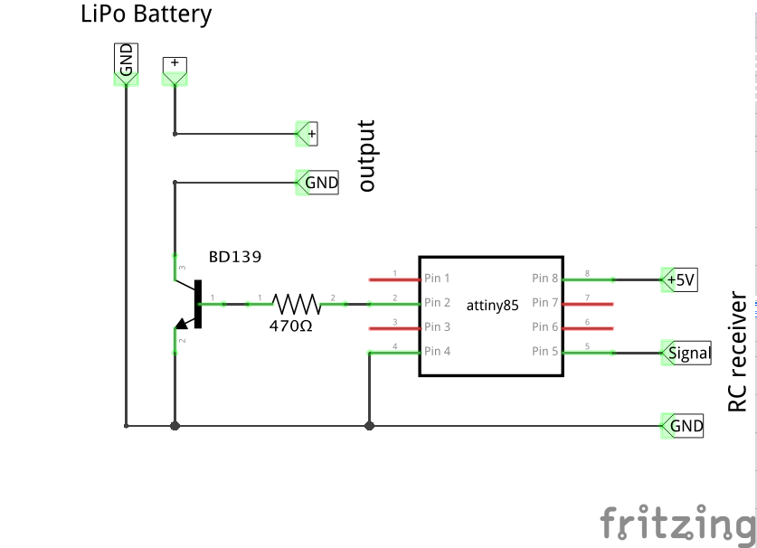

# attiny_rc_switch
On/Off Switch for RC models driven by PWM signal. Based on ATtiny85, 12V capable.

This small device allows to turn on/off different devices on RC devices: airplanes, quadcopter drones, cars. 
It uses one RC PWM channel as input and provides power on output pins when channel pulse length is above 1700us.
Excellent to switch LED strips. Output current is up to 500mA.

# Hardware

* AVR ATtiny x5 series microcontroller. Compiled code takes slightly above 2kB, so will fit into ATtiny45 and ATtiny85. When smoothing is removed, code will fit into ATtiny25
* 220 Ohm resistor
* BD139 or similar NPN bipolar transistor

# Notes

* Arduino IDE 1.6.6. Should work on older releases, but never tested
* ATtiny45/85 board definitions. Tested with [damellis/attiny](https://github.com/damellis/attiny)
* Uses 8MHz internal osciallator 
* BD139 resistor capabilities are: max current load 1.5A and up to 8W. But, there are few limitations:
** base resistor is scaled to allow saturation on up to 500mA
** On higher loads voltage drop might appear
** On 12V and 500mA power is already na 6W, so really, do not exceed this limit...